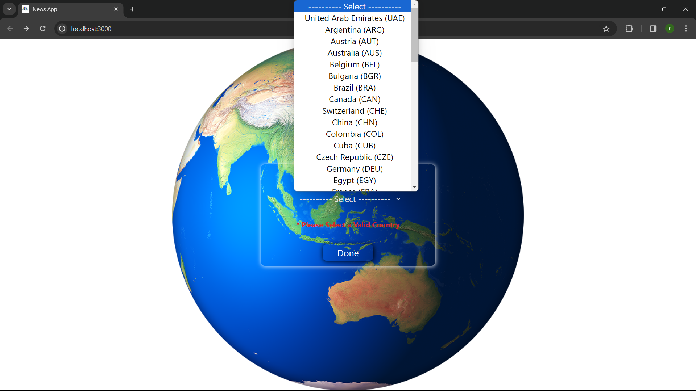
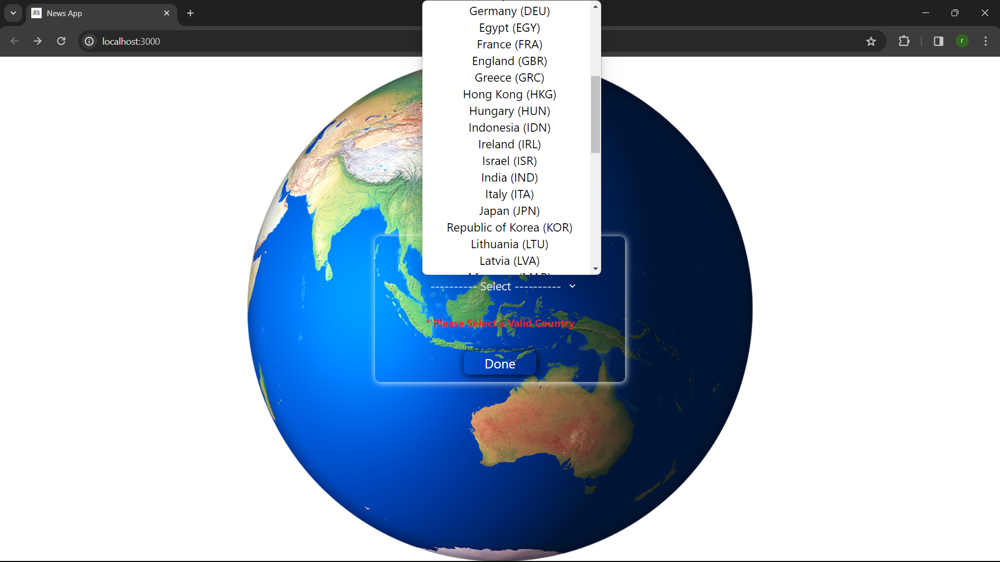
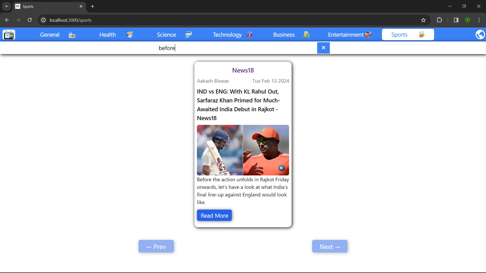
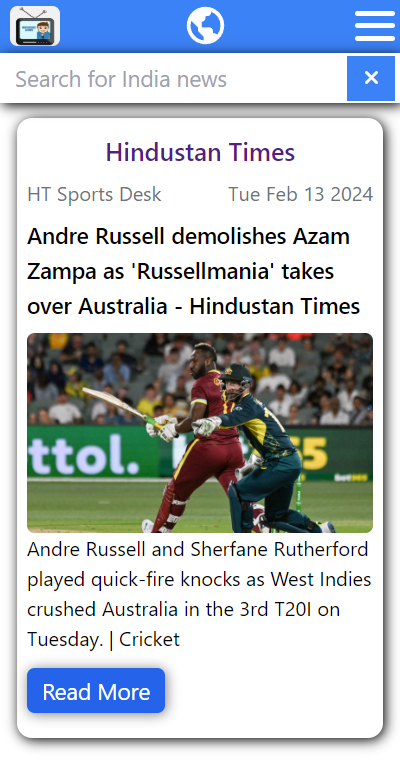
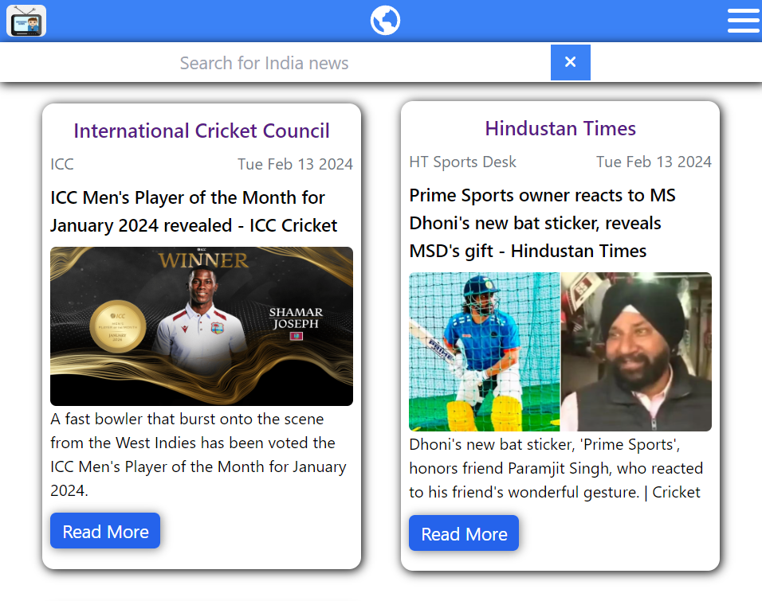
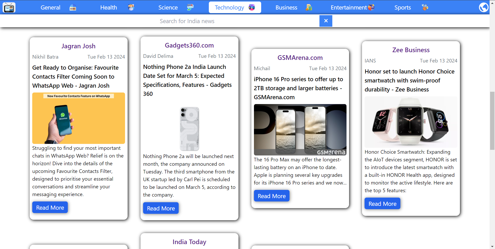

# </img> News WebApp

## Technologies used
</img>
</img>
</img>
</img>

### Setup Repository

1. Fork this Repository
2. Clone Repository in your PC using `git clone "Repo URL"`
3. Run `npm install` or `yarn install` command in your teriminal.
4. Run `npm run start` or `yarn start` command to see application in browser.

### Features

1. App is made using third-party API [News API](https://newsapi.org/).
2. App contains **Top-headlines** from 53 countries in their **Regional Language, country name is also changeable**.
</img>
</img>
</img>
</img>

3. Search using **News Description** in search bar for getting **desired News**.
</img>

4. WebApp is also responsive for all devices.
*Mobile Devices :*
 
</img>
 
*Tablet :*
 
</img>
 
*Desktop :*
 
</img>